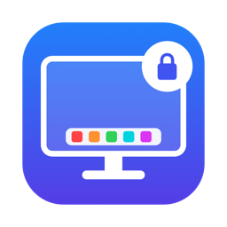

<p align="center">
  
</p>

<h1 align="center">DockPin</h1>

<p align="center">Gardez le Dock de votre Mac sur l’écran de votre choix.</p>

<p align="center">
  <a href="https://github.com/ulric-soft-connect-be/DockPin/releases/latest"><b>⬇︎ Télécharger DockPin</b></a>
</p>

<p align="center">
  <a href="README.md">English</a> ·
  <b>Français</b> ·
  <a href="README.de.md">Deutsch</a> ·
  <a href="README.nl.md">Nederlands</a> ·
  <a href="README.es.md">Español</a> ·
  <a href="README.it.md">Italiano</a>
</p>

---

Avec plusieurs écrans, macOS déplace le Dock sur l’écran dont vous poussez le bas avec le curseur. DockPin l’en empêche : le Dock reste sur l’écran choisi, et vous pouvez le déplacer vers un autre écran avec un raccourci clavier et un clic.

## Fonctions

- **Verrouiller le Dock sur un écran.** Sur les autres écrans, le curseur s’arrête juste avant le bord du Dock : celui-ci ne saute plus. Les bords partagés entre deux écrans restent franchissables.
- **Choisir l’écran avec un raccourci et un clic.** Pressez **⌃⌥⌘D**, puis cliquez sur l’écran voulu. Le Dock s’y déplace et y reste verrouillé.
- **Autoriser d’autres écrans** si vous voulez que le Dock puisse aller sur plusieurs écrans.
- **Déplacer le Dock ponctuellement.** Maintenez **⌥ Option** en poussant le curseur en bas d’un autre écran.
- **Retour automatique.** Au démarrage, au réveil et au branchement ou débranchement d’un écran, le Dock revient sur son écran.
- **Mode présentation** : masque le Dock sur tous les écrans pendant un partage d’écran ou une réunion, puis rétablit votre réglage.
- **Discret.** Pas d’icône dans le Dock (sauf pendant qu’une fenêtre de DockPin est ouverte), et l’icône de la barre des menus peut être masquée.
- **Six langues** : anglais, français, allemand, néerlandais, espagnol, italien. DockPin suit la langue de macOS par défaut ; vous pouvez la changer dans les réglages.

## Prérequis

- macOS 13 Ventura ou plus récent, Mac Apple silicon ou Intel.
- Réglages Système › Bureau et Dock › **« Les écrans disposent d’espaces distincts »** activé. Sans cela, macOS garde toujours le Dock sur l’écran principal.
- Le Dock en bas, à gauche ou à droite de l’écran.

## Installation

1. Téléchargez **DockPin-x.y.z.dmg** depuis la [dernière version](https://github.com/ulric-soft-connect-be/DockPin/releases/latest).
2. Ouvrez l’image disque et glissez **DockPin** sur **Applications**.
3. Ouvrez DockPin depuis le dossier Applications. DockPin n’est pas encore notarisé par Apple : la première fois, macOS refuse de l’ouvrir. Allez dans **Réglages Système › Confidentialité et sécurité**, faites défiler, cliquez sur **Ouvrir quand même** à côté du message concernant DockPin, puis confirmez.
4. Accordez l’autorisation **Accessibilité** quand elle est demandée (Réglages Système › Confidentialité et sécurité › Accessibilité). DockPin en a besoin pour retenir le curseur au bord des écrans et pour déplacer le Dock. Le verrouillage démarre dès que l’accès est accordé.

## Choisir l’écran du Dock

- **Clavier et souris :** pressez **⌃⌥⌘D**. Un voile apparaît sur chaque écran avec un aperçu du Dock. Cliquez sur l’écran voulu. **Échap** ou un clic droit annule.
- **Fenêtre de réglages :** cliquez sur un écran du plan, ou choisissez-le dans la liste *Écran verrouillé*.
- **Icône de la barre des menus :** sous-menu *Écran du Dock*.

## Raccourcis clavier

| Action | Par défaut |
| --- | --- |
| Choisir l’écran du Dock (puis clic) | ⌃⌥⌘D |
| Ouvrir les réglages | ⌃⌥⌘S |
| Activer / désactiver le verrouillage | — |
| Mode présentation | — |

Modifiez-les dans **Réglages › Raccourcis clavier** : cliquez sur un raccourci et tapez la nouvelle combinaison (⌫ efface, Échap annule). Un raccourci affiché en rouge est déjà utilisé par une autre app.

## Réglages

- **Écran du Dock :** plan de vos écrans, écran verrouillé, *Ramener le Dock maintenant*.
- **Verrouillage :** activation, écrans supplémentaires autorisés, touche pour déplacer le Dock ponctuellement (⌥ Option par défaut), retour automatique.
- **Mode présentation :** masquer le Dock sur tous les écrans.
- **Raccourcis clavier :** voir ci-dessus.
- **Général :** langue de l’interface, ouverture à la connexion, icône de la barre des menus.

Pendant qu’une fenêtre de DockPin est ouverte (Réglages, À propos), DockPin affiche son menu dans la barre des menus de macOS : *À propos de DockPin*, *Réglages…*, *Quitter DockPin* et le menu *Aide*, qui ouvre cette page. macOS ne le permet qu’aux apps qui ont une icône dans le Dock : l’icône apparaît donc le temps que la fenêtre est ouverte, puis disparaît.

## Icône de la barre des menus masquée ?

Rouvrez DockPin (Spotlight, Launchpad ou Finder) ou pressez **⌃⌥⌘S** : la fenêtre de réglages réapparaît.

## Automatisation

DockPin comprend les liens `dockpin://`, utilisables depuis Raccourcis, des scripts ou le Terminal :

```bash
open "dockpin://pick"                 # choisir l’écran en cliquant
open "dockpin://lock?screen=2"        # caler le Dock sur l’écran n° 2 (numérotés de gauche à droite)
open "dockpin://lock?screen=LG"       # … ou par nom (partiel), UUID, ou « main »
open "dockpin://home"                 # ramener le Dock sur l’écran verrouillé
open "dockpin://unlock"               # désactiver le verrouillage (aussi : lock, toggle)
open "dockpin://presentation?on=1"    # mode présentation (0 pour en sortir, sans valeur = bascule)
open "dockpin://language?code=fr"     # langue de l’interface (en, fr, de, nl, es, it, system)
open "dockpin://settings"             # aussi : dockpin://about
```

## Dépannage

- **Le Dock saute encore sur les autres écrans.** Vérifiez que DockPin est activé dans Réglages Système › Confidentialité et sécurité › Accessibilité. S’il est activé mais que le verrouillage ne fonctionne toujours pas, retirez DockPin de cette liste avec le bouton **−**, puis ajoutez-le de nouveau.
- **Le Dock ne va pas sur l’écran choisi.** Vérifiez que « Les écrans disposent d’espaces distincts » est activé (Réglages Système › Bureau et Dock), puis fermez et rouvrez votre session.
- **Un raccourci ne fonctionne pas.** Il est sans doute déjà utilisé par une autre app (il apparaît en rouge dans les réglages). Choisissez une autre combinaison.

## Confidentialité

DockPin ne collecte aucune donnée et n’établit aucune connexion réseau. Les liens comme *Aide* s’ouvrent simplement dans votre navigateur.

## Désinstallation

Quittez DockPin (icône de la barre des menus › *Quitter DockPin*), placez-le de Applications à la corbeille, puis retirez-le de Réglages Système › Confidentialité et sécurité › Accessibilité.

---

<p align="center"><sub>© 2026 Soft-Connect</sub></p>
